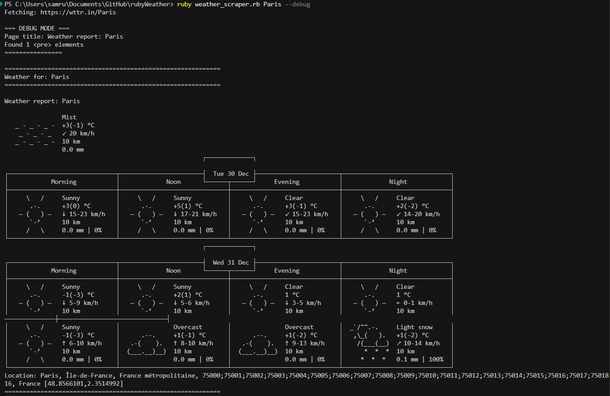

# Ruby Weather Scraper

A simple Ruby weather application that fetches current weather data using Nokogiri and wttr.in service.



## Prerequisites

- Ruby 2.7 or higher
- Bundler for dependency management

## Installation

1. Clone this repository

2. Install dependencies:
```bash
bundle install
```

## Usage

Fetch current weather data for any city worldwide.

**Full ASCII Art Weather:**
```bash
ruby weather_scraper.rb Mumbai
```
Displays detailed 3-day forecast with ASCII art graphics, and extracts temperature readings using Nokogiri.

**Simple One-Line Format:**
```bash
ruby weather_scraper.rb Mumbai --simple
```
Output: `Mumbai: 🌫 +26°C`

**Detailed JSON Format:**
```bash
ruby weather_scraper.rb "New York" --json
```
Outputs:
```
Weather for: New York, United States
Temperature: -13°C (8°F)
Condition: Clear
Wind: 15 km/h WNW
Humidity: 45%
Visibility: 10 km
Feels Like: -18°C
```

**Plain Text Format:**
```bash
ruby weather_scraper.rb Tokyo --plain
```
Output: `Tokyo: 🌫 🌡️+26°C 🌬️↘12km/h`

**Custom Field Format:**
```bash
ruby weather_scraper.rb London --custom
```
Output: `London: ⛅️ +11°C ↑16km/h 71%` (shows location, condition, temperature, wind, humidity)

**Debug Mode:**
```bash
ruby weather_scraper.rb Paris --debug
```

**Format Options:**
- `--full` - Full ASCII art weather display (default)
- `--simple` - Compact one-line format
- `--plain` - Plain text detailed format
- `--custom` - Custom format with specific fields
- `--json` - JSON format with complete weather data
- `--debug` - Display debug information


## Features

- **Multiple output formats** (ASCII art, JSON, plain text, custom)
- **3-day weather forecast** with hourly breakdown (full mode)
- **Real-time weather data** from wttr.in
- **Temperature extraction** using Nokogiri regex parsing
- **Multi-word city support** (e.g., "New York", "Los Angeles")
- **Automatic SSL handling** for secure connections
- **Error handling** with helpful debugging messages
- **Support for any city worldwide**
- **No API key required**
- **Simple command-line interface**
- **Debug mode** to troubleshoot connection and parsing issues

## How It Works

Uses Nokogiri to parse HTML from wttr.in and extract weather information. wttr.in is a terminal-friendly weather service that provides data in multiple formats without requiring an API key.

## Troubleshooting

**Issue**: Cannot load nokogiri

**Solution**: Run ``bundle install``

**Issue**: No weather data returned

**Solution**: Try debug mode ``ruby weather_scraper.rb <city> --debug``

**Issue**: City not recognized

**Solution**: Use full city names or try major cities

**Issue**: SSL connection errors

**Solution**: The script automatically handles SSL certificate issues with OpenSSL configuration

## Tech Stack

- Ruby
- Nokogiri - HTML parsing
- Open-URI - HTTP requests
- OpenSSL - SSL/TLS configuration
- CGI - URL encoding
- wttr.in - Weather data source

## License

Educational project. Use responsibly.
